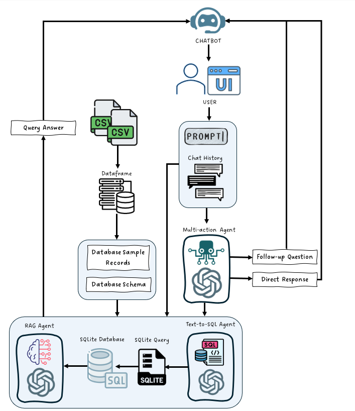

# AI Kata Backend Chatbot Solution

## Interacting with the Chatbot

To interact with the AI Kata chatbot smoothly, follow these steps:

### Web Interface
The chatbot is deployed as a simple, accessible web application. You can interact with it by visiting:
[Chat with Velociraptor](https://chatwithvelociraptor.netlify.app/)

### Instructions for Use
1. **Enter Username**: Upon visiting the website, you will be prompted to enter a username. If no username is provided, a random guest username will be assigned.
   - You can go back to your chat history by reentering your old username.
2. **Chat with the Bot**: Use the input box at the bottom of the screen to type your message and click the "Send" button. The chatbot will respond based on your queries.
   - Please wait patiently after you press "Send" for the chatbot to generate a response.
3. **End Session**: To end the current session, click the "End Session" button. This will clear the chat history and prompt you to enter a new username if you want to start a new conversation.

### Postman Interaction
If you prefer to interact with the chatbot using API endpoints directly, you can use Postman:
- **Endpoint to Chat**: `POST https://velociraptor-e9d29c6f39ce.herokuapp.com/chat`
  - **Parameters**: Provide `username` and `message` as form data.
- **Endpoint to Load Chat History**: `POST https://velociraptor-e9d29c6f39ce.herokuapp.com/get_chat_history`
  - **Parameters**: Provide `username` as form data.
- **Endpoint to End Session**: `POST https://velociraptor-e9d29c6f39ce.herokuapp.com/end_session`
  - **Parameters**: Provide `username` as form data.

## Documentation

### Key Features
1. **Three-Agent System**
   - The solution utilizes a modular three-agent system to effectively manage user queries:
     - **Intent Recognition Agent**: This agent is responsible for understanding user intents based on the given input, ensuring that the request is correctly categorized.
     - **Entity Retrieval Agent**: Extracts critical entities such as order numbers, product names, dates, and other pertinent details required to provide a proper response.
     - **Response Generation Agent**: This agent combines the intent and extracted entities, along with prior conversation history, to generate a relevant, context-aware response.

2. **Bias and Hallucination Prevention**
   - The chatbot includes robust mechanisms to prevent hallucinations by validating all information against the product database and avoiding the generation of fake or misleading information.
   - Anti-bias measures are employed to ensure impartiality when users repeatedly inquire about similar products, maintaining objectivity in the responses.

3. **Multi-Intent Handling**
   - The chatbot is capable of managing complex, nested user intents such as product comparisons, order status inquiries, return eligibility, and more. This ensures a more personalized and seamless user experience.

### Code Structure
- **`test.py`**: The main entry point for the backend server. This script initializes the Flask server and manages incoming requests.
- **`agents.py`**: Contains the core components of the chatbot. Each agent (Intent Recognition, Entity Retrieval, Response Generation) is modularized within this directory.
- **`my_database.db`**: Self-made sql database using sqlalchemy.
- **`data/`**: Contains any sample data files, specifically orders and products.
- **`requirements.txt`**: Lists all Python packages required to run the solution, ensuring easy setup of the environment.
- **`README.md`**: Documentation file with instructions on setup, usage, and interaction methods.

### MLOps
- **Backend**: The backend is hosted on Heroku, utilizing a dedicated paid server to ensure reliable performance and scalability.
- **Frontend**: The frontend is deployed on Netlify, providing a user-friendly interface for users to interact with the chatbot.
- **Modular Agent-Based Design**: The three-agent system allows for scalability, independent testing, and easy modifications. Each agent is responsible for a distinct part of the process, from understanding intents to generating responses, enhancing the flexibility and maintainability of the solution.

### Evaluation Criteria

#### Accuracy
- **Intent Recognition**: The chatbot demonstrates a high level of accuracy when detecting user intents, based on an extensive set of test prompts, to ensure that all user requests are correctly categorized.
- **Avoiding Hallucinations**: All responses are validated against the existing database, ensuring no fictitious or misleading information is given to the user.
- **Bias Control**: The entity retrieval agent includes mechanisms to avoid preferential responses, especially for frequently queried products.

#### Response Time
- **Performance Optimization**: The backend utilizes Heroku server, it provides asynchronous processing, optimizing the overall response time and minimizing latency to provide users with a smooth experience.

#### Tech Stack and Reasoning
- **Backend**: Python with Flask has been selected for its simplicity and extensibility, making it suitable for rapid prototyping and efficient deployment of the model.
- **Database**: SQLite is used for data storage, providing an easy-to-use and quick solution for prototyping. It can easily be upgraded to a more robust solution if required.

#### Architecture
- **Modular Agent-Based Design**: The three-agent system allows for scalability, independent testing, and easy modifications. Each agent is responsible for a distinct part of the process, from understanding intents to generating responses, enhancing the flexibility and maintainability of the solution.

#### Final Presentation
- **Deployment**: The solution is accessible via a web interface, allowing real-time interaction with the chatbot. This front-end interface has been deployed to provide a simple and intuitive means for judges to test and evaluate the assistant.

### Rubric Considerations
- **Accuracy**: The multi-agent architecture ensures that intent recognition, entity retrieval, and response generation are all handled effectively, leading to a high level of accuracy.
- **Performance**: Asynchronous handling of API requests and optimized database querying techniques are used to deliver a responsive experience with minimal lag.
- **Innovation**: The three-agent approach allows for a more nuanced handling of user interactions, providing detailed and context-aware responses while effectively avoiding common chatbot pitfalls.

### Contact
For any issues or queries, feel free to reach out through the repository's issue tracker.
